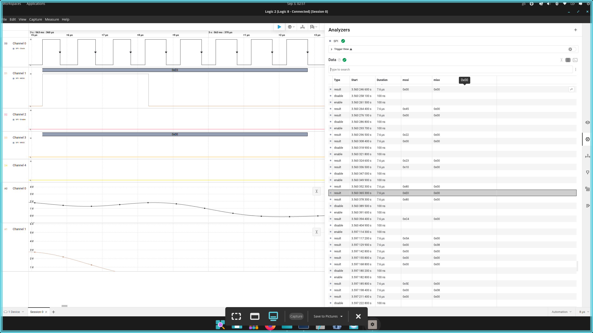
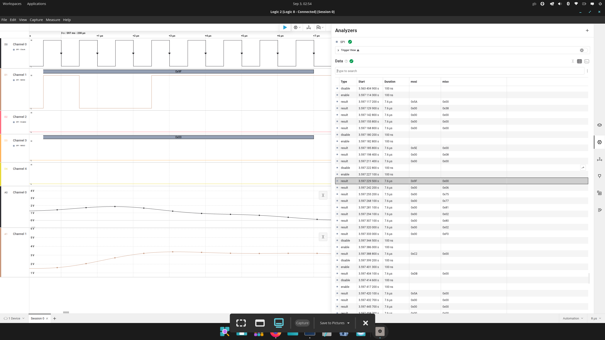
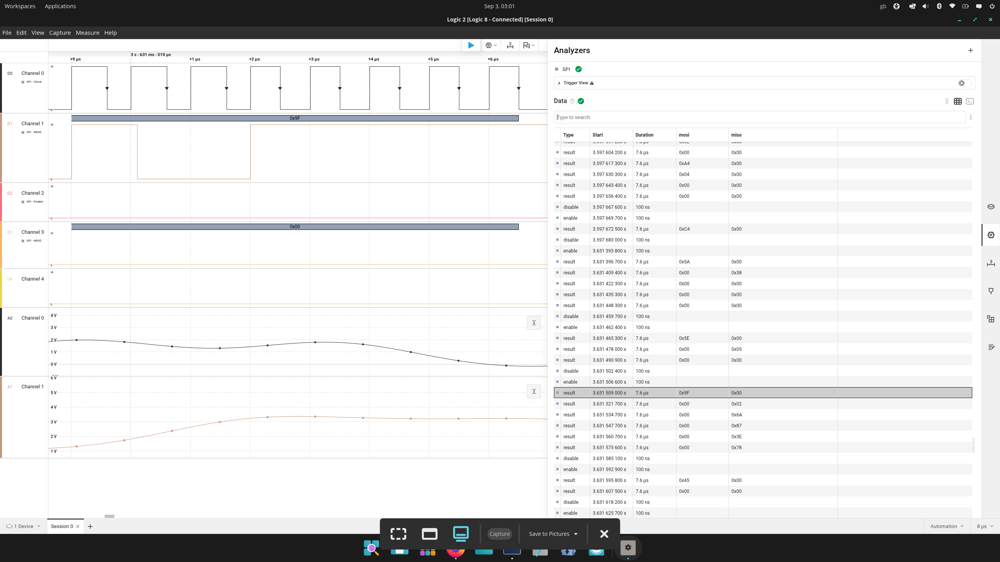
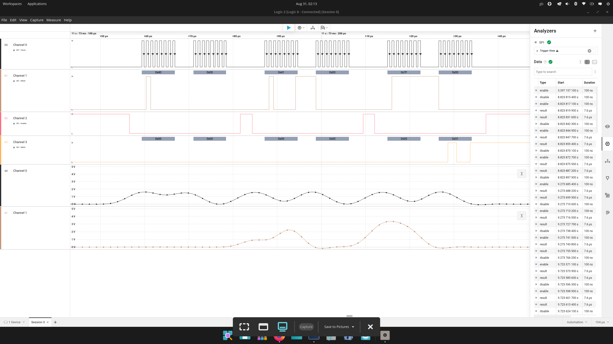

# nfc-security-research-platform

**Hardsignal Labs**

STM32F446RE + ST25R3916B low-level NFC research platform with J-Link debugging and Saleae Logic 8 SPI instrumentation.

## Status

🟢 **PLATFORM BUILT**  
🟢 **BASELINE VALIDATED**  
🟡 **SECURITY EXPERIMENTS — NEXT PHASE**

## Objective

Build a reproducible hardware research platform for investigating NFC protocol behaviour at the boundary between embedded firmware, SPI communication, RF/NFC frontend control, and higher-level ISO-DEP/APDU exchanges.

## Hardware

- STM32 NUCLEO-F446RE
- X-NUCLEO-NFC08A1 / ST25R3916B
- SEGGER J-Link
- Saleae Logic 8
- Linux workstation

## Protocol Stack

### NFC-A / ISO14443A

- REQA / ATQA
- Cascade Level 1 anticollision
- SELECT CL1
- SAK CL1
- Cascade Level 2 anticollision
- SELECT CL2
- SAK CL2

### ISO14443-4 / ISO-DEP

- RATS
- ATS
- ISO-DEP frame reception
- PCB extraction
- INF length extraction
- INF byte extraction

### APDU

APDU exchange successfully demonstrated and captured with Saleae.

Example response:

`02 6A 87 3E 78`

Parsed firmware state:

- PCB: `02`
- INF length: `02`
- INF[0]: `6A`
- INF[1]: `87`
- SW1: `6A`
- SW2: `87`
- CRC_A: `3E 78`

## Instrumentation

```text
STM32F446RE
    |
    | SPI
    v
ST25R3916B
    |
    | RF
    v
NFC-A / ISO14443
    |
    v
ISO14443-4
    |
    v
ISO-DEP
    |
    v
APDU
```

## Instrumentation Evidence

### ISO14443-4 RATS


### ATS Response


### ISO-DEP APDU Exchange


### Full Platform Capture

