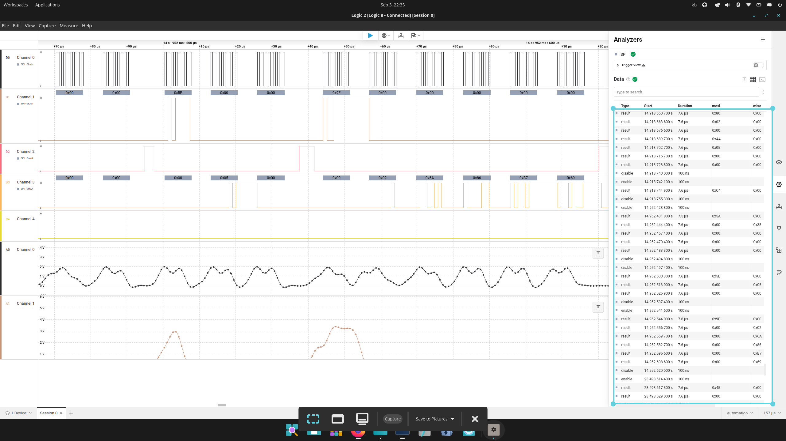
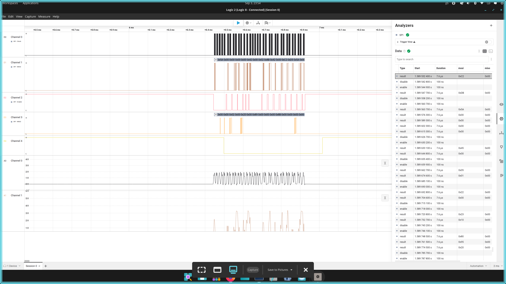

# NFC Security Research Platform

**Hardsignal Labs**

STM32F446RE + ST25R3916B low-level NFC security research platform with J-Link debugging and Saleae Logic 8 SPI instrumentation.

## Status

🟢 **PLATFORM BUILT**  
🟢 **PROTOCOL BASELINE VALIDATED**  
🟢 **CONTROLLED PROTOCOL EXPERIMENTS COMPLETE**  
🟢 **DEBUGGER TIMING / RESET FAULT TESTS COMPLETE**

## Objective

Build a reproducible hardware research platform for investigating NFC protocol behaviour across the boundary between:

- embedded firmware
- SPI communication
- NFC frontend control
- ISO14443A
- ISO14443-4 / ISO-DEP
- APDU exchanges

The platform provides simultaneous visibility at firmware and physical-bus level using J-Link and Saleae Logic 8.

## Hardware

- STM32 NUCLEO-F446RE
- X-NUCLEO-NFC08A1 / ST25R3916B
- SEGGER J-Link
- Saleae Logic 8
- Linux workstation

## Protocol Stack

### NFC-A / ISO14443A

Implemented and observed:

- REQA / ATQA
- Cascade Level 1 anticollision
- SELECT CL1
- SAK CL1
- Cascade Level 2 anticollision
- SELECT CL2
- SAK CL2

### ISO14443-4 / ISO-DEP

Implemented and observed:

- RATS
- ATS
- ISO-DEP transmission
- ISO-DEP reception
- PCB extraction
- INF length extraction
- INF byte extraction
- APDU response parsing

## Known-Good Baseline

Known-good firmware transaction:

```text
ISO-DEP TX:
02 00 A4 05 00 00

ISO-DEP RX:
02 6A 86 B7 69
```

Parsed firmware state:

```text
PCB     = 02
INF0    = 6A
INF1    = 86
SW1     = 6A
SW2     = 86
INF_LEN = 02
```

For this transaction, the parser excludes the final two received bytes from the APDU status-word interpretation.

The `6A 86` status corresponds to an APDU rejection associated with incorrect P1/P2 parameters.

## Controlled Protocol Experiments

### Experiment 1 — Known-Good Baseline

TX:

```text
02 00 A4 05 00 00
```

RX:

```text
02 6A 86 B7 69
```

Result:

- Stable baseline established.
- Firmware RX buffer and parser state verified with J-Link.
- Physical SPI transaction independently verified with Saleae.

### Experiment 2 — APDU P1 Mutation

Changed:

```text
P1: 05 -> 04
```

TX:

```text
02 00 A4 04 00 00
```

RX:

```text
02 6A 87 3E 78
```

Parsed response:

```text
SW1 = 6A
SW2 = 87
```

A single controlled APDU-byte mutation therefore produced an observable response transition:

```text
6A86 -> 6A87
```

This demonstrates a causal relationship between the modified command field and the target's protocol response.

### Experiment 3 — Final APDU Byte Mutation

Changed:

```text
00 -> 01
```

TX:

```text
02 00 A4 05 00 01
```

RX remained:

```text
02 6A 86 B7 69
```

No observable response change occurred under this test condition.

### Experiment 4 — ISO-DEP PCB Mutation

Changed transmitted PCB:

```text
02 -> 03
```

TX:

```text
03 00 A4 05 00 00
```

Observed RX:

```text
02 6A 86 B7 69
```

No observable response or parser-state change occurred under this test condition.

### Experiment 5 — Firmware-to-Physical SPI Correlation

J-Link RAM state:

```text
TX = 02 00 A4 05 00 00
RX = 02 6A 86 B7 69
```

Saleae captured the corresponding ST25R3916B SPI transactions.

FIFO transmission:

```text
MOSI:
80 02 00 A4 05 00 00
```

`80` is the FIFO access command, followed by the six bytes present in the firmware TX buffer.

Transmit command:

```text
C4
```

FIFO reception:

```text
MOSI:
9F 00 00 00 00 00

MISO:
00 02 6A 86 B7 69
```

The received SPI bytes correlate directly with the firmware RX buffer.

Approximate observed interval between FIFO transmission/transmit activity and FIFO reception in this capture was **33.8 ms**.

Evidence:



## Debugger Timing and Recovery Tests

These tests used debugger-induced execution pauses and MCU reset to study recovery behaviour.

They should not be interpreted as proof of general fault resistance or electrical glitch tolerance.

### Fault Test 1 — Pause Before Transmit

Execution was halted after FIFO preparation and before the transmit command.

Before resuming, the previous RX state was cleared.

After execution resumed, a fresh response was received:

```text
02 6A 86 B7 69
```

The tested transaction recovered successfully from the extended debugger pause at this boundary.

### Fault Test 2 — Pause Inside SPI FIFO Write

Execution was halted at:

```text
0x080001E8
```

At this point:

- the FIFO command byte (`0x80`) had already been transmitted
- chip select remained asserted
- payload transmission had not yet started

The previous RX state was cleared before resuming.

After execution resumed, a fresh response was received:

```text
02 6A 86 B7 69
```

This demonstrates recovery from the debugger-induced pause at this specific point inside the FIFO-write operation.

### Fault Test 3 — MCU Reset and Recovery

The previous RX state was cleared and the STM32 was reset through J-Link without reflashing the firmware.

After reset and reinitialization, a fresh response was observed:

```text
02 6A 86 B7 69
```

The platform therefore returned to the known-good transaction state after the tested MCU reset.

### Fault Test 4 — Extended Mid-SPI Pause + Saleae Capture

Execution was halted at:

```text
0x080001E8
```

after the FIFO command byte had been issued and before the payload bytes were sent.

The debugger-induced halt was intentionally extended, but its duration was **not precisely measured**.

After resuming, the transaction completed and the expected response was received:

```text
02 6A 86 B7 69
```

Saleae captured the surrounding SPI activity and the first post-pause bus activity.

Evidence:



## Instrumentation Architecture

```text
                    J-Link
                       |
                       | SWD
                       v
                 STM32F446RE
                       |
                       | SPI <------ Saleae Logic 8
                       v
                 ST25R3916B
                       |
                       | RF
                       v
                NFC-A / ISO14443
                       |
                       v
                 ISO14443-4
                       |
                       v
                    ISO-DEP
                       |
                       v
                     APDU
```

This provides two complementary observation layers:

```text
J-Link  -> firmware execution + RAM state
Saleae  -> physical SPI bus transactions
```

The two layers were correlated during the known-good NFC transaction.

## Additional Instrumentation Evidence

### ISO14443-4 RATS


### ATS Response


### ISO-DEP APDU Response


### Full Platform Capture


## Findings

The project demonstrated:

1. Low-level STM32 control of the ST25R3916B NFC frontend.
2. ISO14443A activation through ISO-DEP/APDU exchange.
3. Firmware-level inspection of NFC TX/RX buffers with J-Link.
4. Physical SPI decoding with Saleae Logic 8.
5. Direct correlation between firmware buffers and physical SPI traffic.
6. Controlled APDU mutation with an observable target-response transition.
7. Controlled negative protocol experiments where mutations produced no observable response change.
8. Recovery after debugger-induced execution pauses at selected transaction boundaries.
9. Recovery after a debugger-induced pause inside an active FIFO-write sequence.
10. Recovery to the known-good transaction after MCU reset without reflashing.

## Limitations

The fault experiments in this phase used debugger-controlled execution pauses and MCU reset.

They did **not** perform:

- supply-voltage glitching
- clock glitching
- electromagnetic fault injection
- deliberate SPI bit corruption
- arbitrary RF-layer fault injection

Therefore the results characterize behaviour under the specific controlled tests performed here and should not be interpreted as evidence of general fault tolerance.

## Project Outcome

The result is a reproducible NFC research platform capable of observing a transaction across multiple abstraction layers:

```text
firmware
   ↓
SPI
   ↓
ST25R3916B
   ↓
RF / ISO14443A
   ↓
ISO-DEP
   ↓
APDU
```

The platform can now serve as a foundation for future embedded-security, protocol-analysis, and controlled fault-injection research.

---

**Hardsignal Labs — Cyber-Physical Security Research**
